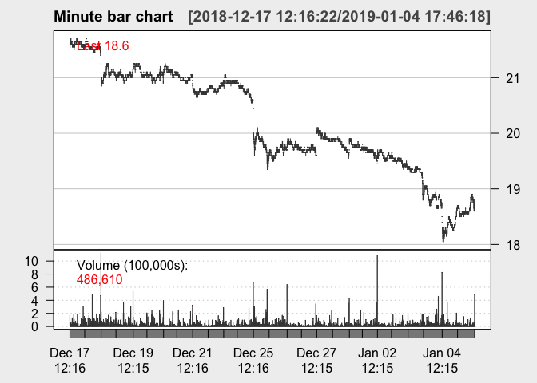

<!-- README.md is generated from README.Rmd. Please edit that file -->
mladv
=====

mladv is a r package used to clean, convert and analyze the financial data. It also provides various tools to apply machine learning to financial data.

Installation
------------

You can install the released version of mladv from [CRAN](https://CRAN.R-project.org) with:

``` r
install.packages("mladv")
```

We expect to release the package as soon as possible in CRAN. At the mean time, you can install it with devtools:

``` r
devtools::install_github("thanhuwe8/mladv")
```

Example
-------

First you load the data from the package

``` r
library(mladv)
data(SSI_data)
head(SSI_data,3)
#>                  Time Price  Size cum_volume  ppt
#> 1 2018-12-17 10:15:38  29.1 22050      22050 1.37
#> 2 2018-12-17 10:16:27  29.1   500      22550 0.03
#> 3 2018-12-17 10:17:12  29.2  2000      24550 0.12
```

With the data\_set, we can convert the raw market data into different bars such as time bars or volume bars as examples below with `SSI_data`

``` r
volume6000 <- volumebarr(SSI_data, 15000)
head(volume6000)
#>                  Date  Open  High   Low Close Volume Transaction
#> 1 2018-12-17 11:15:38 29.10 29.10 29.10 29.10  22050           1
#> 2 2018-12-17 11:24:17 29.10 29.20 29.05 29.05  17380          15
#> 3 2018-12-17 11:27:25 29.05 29.05 29.05 29.05  15330           5
#> 4 2018-12-17 11:31:58 29.10 29.10 29.05 29.05  21340          10
#> 5 2018-12-17 11:32:49 29.05 29.05 29.00 29.00  15150           7
#> 6 2018-12-17 11:41:33 29.00 29.10 29.00 29.10  28030          12
```

``` r
minute_bar <- timebar(SSI_data, "minute")
head(minute_bar)
#>                  Date  Open  High   Low Close Volume
#> 1 2018-12-17 11:16:27 29.10 29.10 29.10 29.10  22550
#> 2 2018-12-17 11:17:12 29.20 29.20 29.20 29.20   2000
#> 3 2018-12-17 11:18:11 29.10 29.10 29.10 29.10    100
#> 4 2018-12-17 11:19:17 29.10 29.15 29.10 29.15    990
#> 5 2018-12-17 11:20:40 29.05 29.05 29.05 29.05   2600
#> 6 2018-12-17 11:22:07 29.05 29.05 29.05 29.05   6800
```

We can still use functions from popular packages such as `quantmod` or `ggplot2` with the return data.frame

``` r
library(xts)
#> Loading required package: zoo
#> 
#> Attaching package: 'zoo'
#> The following objects are masked from 'package:base':
#> 
#>     as.Date, as.Date.numeric
library(quantmod)
#> Loading required package: TTR
#> Version 0.4-0 included new data defaults. See ?getSymbols.
minute_plot <- xts(minute_bar[,2:6], order.by=minute_bar$Date)
candleChart(minute_plot, theme="white", multi.col=T, name="Minute bar chart")
```



We will add more useful functions later.
